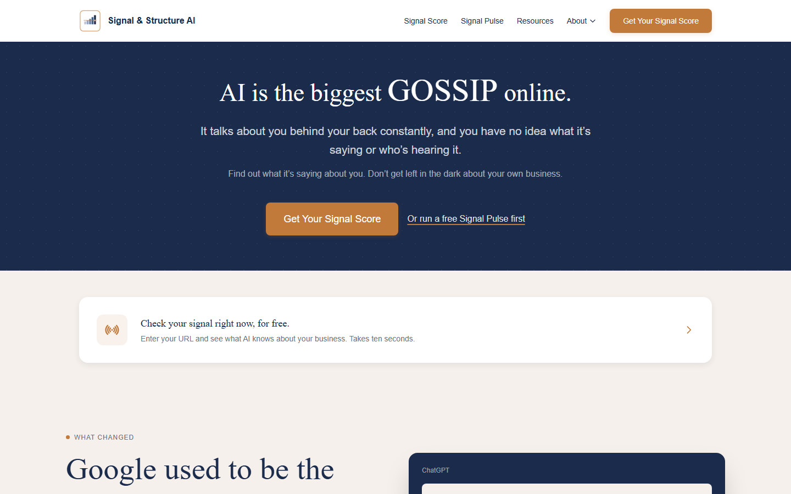
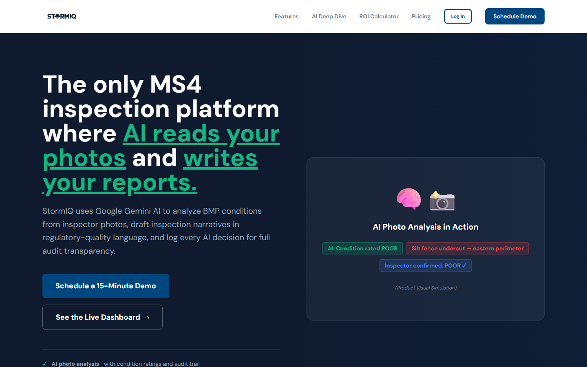
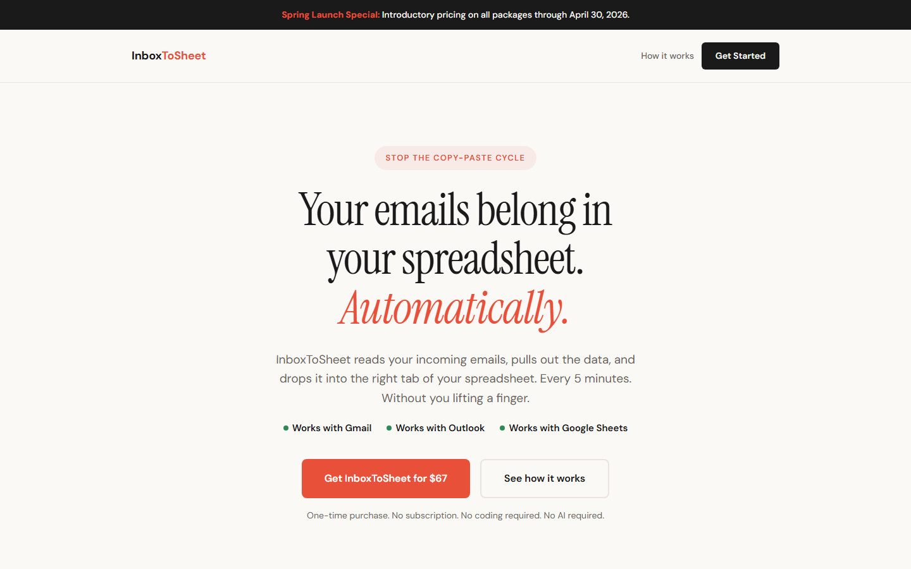
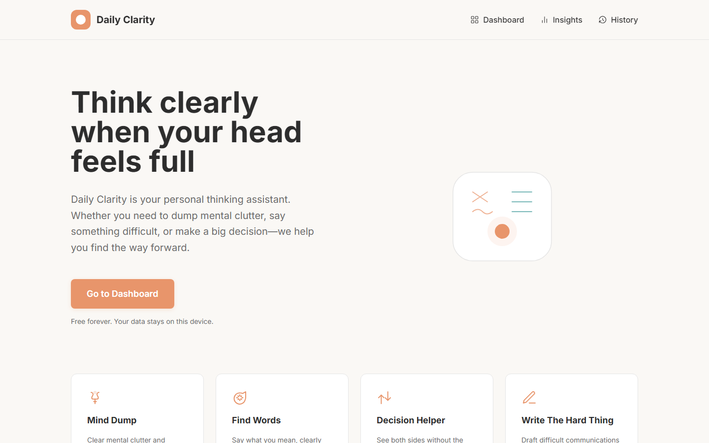
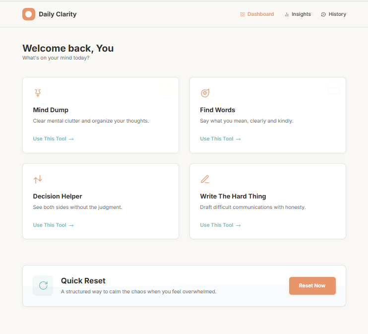
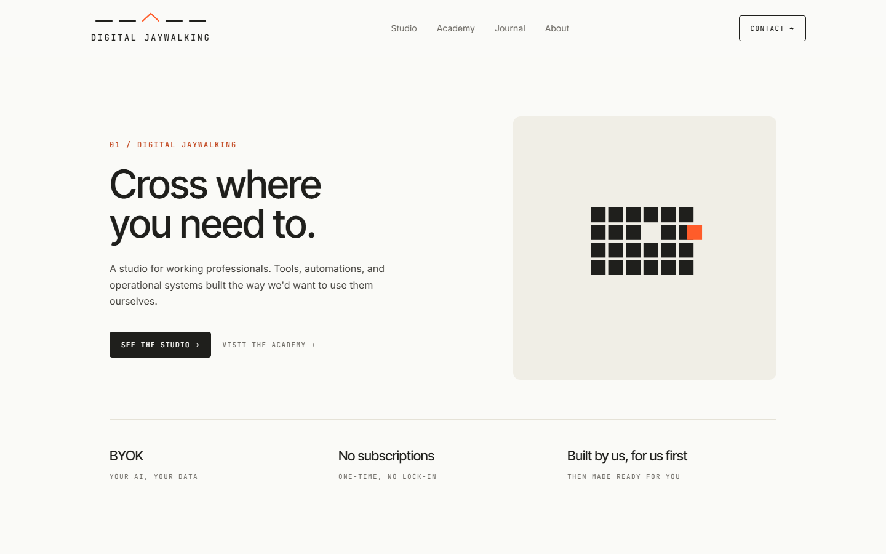

# What I Build

I design and deploy AI-powered systems that run in production: multi-agent platforms, municipal compliance tools, content operations, and the internal infrastructure that keeps it all coordinated. Not prototypes. Not demos. Shipped.

**Jump to:** [Flagship Platforms](#flagship-platforms) · [Life OS](#life-os--personal-infrastructure) · [Products](#products) · [Infrastructure](#infrastructure) · [Hackathons](#hackathons) · [Teaching](#teaching--courses) · [Also Built](#also-built)

---

## Flagship Platforms

### Signal & Structure AI: AI Discoverability Platform
> Helps businesses get found and accurately represented by AI assistants like ChatGPT, Claude, and Gemini.

  

Full AI discoverability platform with four production MCP servers (Signal Watch, Signal Pulse, Signal Advisor, Knowledge Base) connected directly into Claude. Scans websites for schema markup quality, checks AI platform mentions across every major model, and generates prioritized action plans. Multi-tenant client portal has three role-based dashboards (owner, client, VA), automated lead generation, and a research-backed white paper on AI discoverability. The public site also registers its own WebMCP tools directly on the page (`get_business_facts`, `get_services`, `recommend_service`, `ask_advisor`, `get_our_score_history`, and one action tool that always confirms with the visitor before it does anything), so a browser AI agent can query the business and act on a visitor's behalf without guessing.

`Python` `FastAPI` `Supabase` `Railway` `MCP Protocol` `WebMCP` `Claude API`

---

### StormIQ: Municipal Compliance Platform
> AI-powered tools for stormwater professionals and municipal operators.

 

21-product platform for MS4 stormwater compliance. AI photo analysis using computer vision for field inspection reports, automated narrative generation from voice-to-text field notes, and compliance tracking dashboards. Targeting 122 NC MS4 permittees as initial market. Five-service Railway deployment: FastAPI backend, Next.js dashboard, PostgreSQL, MinIO object storage, background worker.

`Python` `FastAPI` `Next.js` `PostgreSQL` `MinIO` `Railway` `Gemini API`

---

### Marketing OS: Multi-Tenant Marketing Platform
> One pipeline serving both my own brands and outside clients as tenants, with service level configured per tenant instead of forked into separate code paths.

 

Cross-brand marketing system built on a markdown/YAML truth layer with Supabase for operational state and fail-closed, per-tenant row-level security. A Cloudflare Worker handles approve/reject/edit-request and click-tracking routes; a daily GitHub Actions cron drives dispatch through a two-phase commit (approved to dispatching to published) with proven stuck-job recovery. **Sherman**, a client-facing AI brand-operations persona, handles tenant communication. The **Campaign Concept agent** is a standalone sellable product: it researches a brand and publishes a branded, pitch-ready concept page hands-off. Supersedes an earlier five-brand content-ops platform (Content Command Center, now scoped down to prospecting only).

`Python` `Cloudflare Workers` `Supabase` `GitHub Actions` `Claude API` `Resend` · [Repo](https://github.com/TKHatton/Marketing-OS)

---

### Content Command Center: Automated Prospecting Pipeline
> Lead discovery and cold outreach pipeline for Digital Jaywalking.

 

Automated prospecting pipeline: Google Places API discovers leads at 1 PM, an email scraper pulls contacts, Signal Engine scores them, AI drafts outreach at 2 PM, and approved emails send at 8:47 AM the next day. Its earlier content-generation, scheduling, and multi-brand ambitions were absorbed into Marketing OS above.

`Next.js` `Python` `Supabase` `Railway` `Google Places API` `Claude API` `Resend`

---

### The Drop: AI Content Intelligence
> Replaces hours of video watching with a daily AI-curated digest from 21+ sources.

 

Monitors YouTube channels and RSS sources, auto-transcribes and summarizes new content, delivers a formatted daily digest with audio playback via OpenAI TTS. Webshare rotating residential proxy handles YouTube access at scale. Topic-based discovery in roadmap.

`Python` `Railway` `YouTube API` `OpenAI TTS` `Claude API` `Supabase`

---

### CueBoard: Zoom Meeting Control Plugin
> Hardware button surface for Zoom meeting management. Logitech MX Creative Console plugin.

 

C#/.NET 8 plugin for the Logitech MX Creative Console. 34 mapped actions across 3 pages: quick controls (mute, spotlight, breakout rooms), host tools (flag moments, assign tasks, take notes, export summary), and accessibility controls (captions, timer, participant management). Reached semifinalist round (top 50 of 1,300+ participants). Submission ultimately withdrawn due to health circumstances.

`C#` `.NET 8` `Logitech Actions SDK` `Zoom SDK`

---

### Course Canon: AI Course & Presentation Evaluator
> Evaluates presentations and teaching quality, gives structured feedback.

 

Next.js 14 web UI with Supabase brand library. Generates branded course outlines and materials, ZIP download, delivery pipeline wired to Gumroad webhook with daily cron enrollment emails via Resend.

`Next.js` `Supabase` `Railway` `Claude API` `Resend`

---

### OnboardFlow: Autonomous Employee Onboarding Agent
> Reasons about a new hire's role and department instead of running a fixed script, then executes the onboarding across every connected tool.

  

Gemini-powered agent that reads a new hire's role and decides which tools the onboarding actually needs, in what order, rather than following a hardcoded checklist. Orchestrates Jira, GitHub, Slack, Google Calendar, email, CRM, and Asana behind a FastAPI backend, with every step and result streamed live to a React UI over Server-Sent Events. Firestore holds the full audit trail for compliance. Event-driven via Pub/Sub for async, scalable processing.

`Python` `FastAPI` `React` `Gemini API` `Google ADK` `Firestore` `Server-Sent Events`

[Repo](https://github.com/TKHatton/onboardflow)

---

### Cayenne Watch: Nationwide Vehicle Monitor
> Nationwide monitor for used Porsche Cayenne listings, built as a favor and shipped as a packaged, cross-platform product.

  

Watches 9 listing sources nationwide, dedupes the same vehicle appearing across multiple sites, and scores price against a same-trim/same-year cohort so a fair deal is obvious at a glance. Tiered alerts keep 50-150 daily listings from becoming noise. Drafts outreach messages but never sends without a human tap. Zero-cost architecture running free on the end user's own machine via Docker, with cross-platform launchers (Mac `.command` / Windows `.bat`) built without knowing in advance which OS the recipient would use. 415 tests passing. Delivered with a 4-video narrated setup playlist and a self-serve troubleshooting doc.

`Python` `Docker` `SQLite`

[Repo](https://github.com/TKHatton/cayenne-watch)

---

### Relay: WebMCP-Native Delegate Agent
> An out-of-office agent with enforced limits, not just an auto-reply.

   

Built for the WebMCP Challenge. Lets someone brief a scoped delegate agent before going offline: a short interview drafts the boundary configuration (autonomous actions under a dollar cap, flagged actions that go to a named backup human, hard refusals) instead of making the person write policy from scratch. A missed check-in, a scheduled window, or a manual switch arms the delegate, which then answers coworkers, clients, or other agents inside those limits and logs every decision in plain language. The core technical bet: the page computes a different tool surface per visitor identity and per relay state, live in the browser via `document.modelContext.registerTool`, instead of a static server-side tool list: the principal sees setup tools, a recipient sees exactly one scoped tool, and the surface changes as the relay moves from draft to armed to active.

`TypeScript` `Next.js` `WebMCP` `Claude API`

[Live](https://relay-webmcp.netlify.app/) · [Repo](https://github.com/TKHatton/relay-webmcp)

---

### Regulation Radar: Compliance Change Intelligence
> Computes what actually breaks downstream when a regulation changes, instead of re-auditing everything from scratch.

 

Built for the DevNetwork API + Cloud + AI Hackathon, finished but not submitted in time. Models each company's compliance obligations as a dependency graph; when a public rule changes, it walks the graph from the affected node outward, auto-resolving obligations that genuinely share a mechanism and flagging the ones that only look related. Privacy is structural, not a filter: regulatory text lives in a shared public pool while each tenant's footprint, alerts, and signed compliance briefs stay in their own scoped pool, and evaluation always happens by bringing a public rule into a tenant's private scope. Four sponsor integrations wired end to end against live credentials: Xano for the entire backend (10 tables, ~23 endpoints), Foxit for a working PDF-to-eSign pipeline on every compliance brief, Nutrient for confidence-scored extraction on regulatory text, and SerpApi for autonomous change monitoring. 46 tests, largely integration tests against the live Xano workspace.

`TypeScript` `Next.js` `Xano` `Foxit` `Nutrient` `SerpApi`

[Repo](https://github.com/TKHatton/regulation-radar)

---

## Life OS: Personal Infrastructure

The systems that let me run five ventures in parallel without losing context, dropping leads, or missing deadlines. All deployed, all running daily.

### Roger: Executive Function Command Layer (Retired)
Always-on-top desktop widget plus installable Android PWA, sharing a Supabase backend with no-login device-key sync. Reads my CORE markdown files as the source of truth and ranks priorities deterministically (deadline, money impact, started-but-unfinished, stalled-with-due-retry). Enforces 3-active-task max with a quick-hits lane, clickable definition-of-done checklists, and flips into a bright neon GO HOME ROGER focus alert when I wander, re-escalating every 30 minutes until I'm back. Voice input on both surfaces is local-only (faster-whisper on desktop, Web Speech API on mobile), built for APD and dyslexia. No close button by design. Retired in favor of Minkus below.

`Python` `pywebview` `Supabase` `faster-whisper` `Web Speech API` `PWA` `Netlify` · [Repo](https://github.com/TKHatton/Roger)

---

### Minkus: Voice-First Executive Function Assistant
Rebuilt fresh on top of Roger's design spec and replaced it as my daily driver: an always-listening thinking partner with a floating desktop widget, offline wake-word detection (Vosk, nothing leaves the device pre-wake), and live Deepgram/Cartesia voice in and out. Reads CORE for priorities and current focus, runs a spoken morning brief every day at 7:35 AM, and remembers a rolling window of conversation plus a standing voice/communication-style profile. Ships its own paid-agent intake pipeline (Stripe to email delivery), an ops-day content digest that finds and delivers marketing drafts without ever writing them itself, and a bridge to a second, separately-hosted execution agent (Hermes) for delegated work. 672 tests green, strict TDD throughout.

`Python` `Supabase` `Deepgram` `Cartesia` `Vosk` `SQLite` · [Repo](https://github.com/TKHatton/Minkus)

---

### Stir: Movement-Break Companion
A Rust desktop app for a chronic-illness energy envelope, not a productivity gimmick: an always-on-top floating teddy bear that prompts gentle movement breaks and refuses to fake the data. The core loop (rest, get up, move, sit, rate 1-10, log) never auto-starts the timer, it waits for an explicit "I'm up" press, because pacing without shame mattered more than engagement. Multi-monitor position memory, tray controls, crash recovery, full audio/silent parity, and a session log written straight to SQLite through Rust. Phase 1 shipped and running daily; architecture is intentionally schema-agnostic so later phases (snooze, flare/go-easy streak protection, adaptive pacing) are mostly frontend work.

`Rust` `Tauri` `JavaScript` `SQLite` · [Repo](https://github.com/TKHatton/stir)

---

### CORE: Persistent Memory & Decision System
Never-pruned decisions log, cross-session status tracking, per-venture context files, personal logistics, and health-aware scheduling. Slash commands (`/log`, `/summary`, `/log-chat`) route every session's output to the right place automatically. Every tool I build reads from CORE first.

`Markdown` `YAML` `Claude Code`

---

### Daily Briefing Agent
6:30 AM email pulling from Google Calendar, Opportunity Tracker, Personal CRM, book launch tracker, and a 14-day holiday/awareness calendar. Claude Haiku generates a health-aware 4-part recommendation: PRIMARY / WHY / SECONDARY / SKIP TODAY. Deployed on Railway.

`Python` `Railway` `Claude API` `Supabase` `Resend` · [Repo](https://github.com/TKHatton/daily-briefing)

---

### What's Next Agent
CLI agent that reads across Opportunity Tracker, Personal CRM, Routine Anchor, and book launch status to output a single structured daily recommendation. Health-aware (recovery days, infusion schedule). `python agent.py` gives the answer in seconds.

`Python` `Claude API` `Supabase` · [Repo](https://github.com/TKHatton/whats-next)

---

### Weekly Review Agent
Sunday 8 AM email summarizing the week: OT wins and pipeline, CRM interactions, habit streaks, book launch status. Claude Haiku generates a headline and three priorities. Deployed on Railway.

`Python` `Railway` `Claude API` `Supabase` `Resend` · [Repo](https://github.com/TKHatton/weekly-review)

---

### Opportunity Tracker
Revenue pipeline CLI with 13 active opportunities, automated priority scoring, and daily HTML email summary (overdue, due today, this week, top revenue). $82K tracked pipeline across all ventures.

`Python` `Typer` `Supabase` `Railway` `Resend` · [Repo](https://github.com/TKHatton/opportunity-tracker)

---

### Personal CRM
Relationship intelligence for a solo operator across 24 contacts: family, leads, collaborators, mentors, community. Fuzzy name matching, interaction logging, follow-up tracking, daily email reminders. 14 CLI commands.

`Python` `Click` `Supabase` `Railway` · [Repo](https://github.com/TKHatton/personal-crm)

---

### Client Onboarding
CLI that adds a new client to the CRM, creates an Opportunity Tracker entry, and sends a venture-specific welcome email, all in one command. Four ventures supported: DJ Academy, Course Cannon, Digital Jaywalking, StormIQ. Each has its own HTML email template and tone.

`Python` `Supabase` `Resend` · [Repo](https://github.com/TKHatton/client-onboarding)

---

### Routine Anchor
Nightly SMS check-in system. Texts 5 questions at 9 PM, parses free-text replies, logs to Supabase, tracks streaks. Code complete, pending second Twilio number for personal use.

`Python` `FastAPI` `Twilio` `Supabase` · [Repo](https://github.com/TKHatton/routine-anchor)

---

### Financial Runway Tracker
Next.js 14 + SQLite dashboard tracking income, expenses, burn rate, and projected runway. Pulls weighted pipeline from Opportunity Tracker for revenue projections. Daily email cron. Built, pending Railway deploy.

`Next.js` `SQLite` `Railway` `Resend` · [Repo](https://github.com/TKHatton/financial-runway)

---

## Products

Tools I built, packaged, and sell.

### InboxToSheet: Email-to-Spreadsheet Automation
Four Google Apps Scripts that read incoming emails, extract structured data, and write it to the correct spreadsheet tab automatically, every 5 minutes, no manual input. Security hardening, daily validation, Excel migration tool, and an AI customization prompt included. No coding required.

**$67 one-time** · [Landing page](https://inbox2sheet.netlify.app/) · [Buy on Gumroad](https://jaywalker73.gumroad.com/l/inbox2sheets)

`Google Apps Script` `Gmail API` `Google Sheets API`

---

### FolderSort: Automated File Organization
Desktop app that scans folders and sorts files into clean structures based on rules set once. Preview mode before anything moves. Full undo with backup manifest. File watcher for ongoing auto-sort. Duplicate and temp file cleanup advisor. Windows exe, no Python install needed.

**$97 one-time** · [Landing page](https://foldersort.netlify.app/) · Gumroad listing coming soon

`Python` `PyInstaller` `CustomTkinter` `SQLite`

---

### Protect Your Genius: Book
*Using AI Without Diluting Your Voice.* Thought leadership on maintaining creative and intellectual identity in an AI-augmented world. Kindle published April 22, 2026. Paperback launched May 4, 2026.

[Kindle on Amazon](https://a.co/d/08nbTV6E) · [Paperback on Amazon](https://a.co/d/08nbTV6E)

---

## Infrastructure

### MAOS: Meta-Agentic Operating System
12-component modular multi-agent system architecture across five layers: orchestration, intelligence, execution, memory, and meta. Blueprint complete. Build sequence starts with schema-driven design. Foundation for all future agent work.

---

## Hackathons

| Hackathon | Project | Result |
|-----------|---------|--------|
| Logitech CueBoard | CueBoard Zoom Plugin | Semifinalist: Top 50 of 1,300+ |
| Google Gemini 3 ($50K) | Sewer Sentinel (StormIQ) | Did not place |
| Google Live Agent | Adaptive Drive | Did not place |
| Auth0 | Signal Vault | Did not place |
| WebMCP Challenge | Relay | Results pending |
| DevNetwork API + Cloud + AI Hackathon 2026 | Regulation Radar | Built, not submitted |
| All Things Agentic Hackathon (Google) | OnboardFlow | Results pending, announced Oct 8 |
| All Things Agentic Hackathon (Google) | Blackbox | Results pending, announced Oct 8 |

---

## Teaching & Courses

20+ years of teaching experience, now applied to AI education across Girl Scouts, enterprise teams, and working professionals.

- **Building Agentic Systems That Actually Work**: 90–120 min advanced course on capability-scoped agent design, multi-layer infrastructure, and cost optimization
- **Agents Without the Jargon**: Beginner-friendly, opens with a live demo before definitions
- **Run Better Meetings with AI**: Half-day workshop for meeting-heavy professionals
- **AI in the Wild**: Girl Scout AI badge curriculum across all age levels
- **Start Smart: From Avoiding AI to AI Confidence**: 5-day email drip course
- **AI and Emotional Intelligence**: Conference presentation

---

## Also Built

- **Claude Architect Study Hall**: PWA study companion for Claude Certified Architect Foundations exam. Leitner 5-box spaced repetition, 6 interactive widgets, day gating, review deck. Pairs with System Architect Exam Pro. Screen reader accessible. [Live](https://claude-architect-study-hall.netlify.app/) · [Repo](https://github.com/TKHatton/Claude-Architect-Study-Hall) · `Vanilla JS` `ES Modules` `Supabase` `PWA`
- **Daily Clarity**: AI thinking assistant with 5 tools: Mind Dump, Find Words, Decision Helper, Write The Hard Thing, Quick Reset. Free. [Live](https://dailyclarity.netlify.app/) · [Repo](https://github.com/TKHatton/Daily-Clarity) · `React` `TypeScript` `Gemini API`

   

- **PageSpeak**: Chrome extension for text-to-speech accessibility. Reads articles, documents, and PDFs aloud. `JavaScript` `Chrome Extension API` `Web Speech API`
- **Tip of the Hatton**: Interactive price calculator and service-request form for a freelance brand. Live running total across websites, social management, AI coaching, and custom builds; Netlify Forms captures every submission, no backend. [Repo](https://github.com/TKHatton/tip-of-the-hatton) · `HTML` `JavaScript` `Netlify Forms`
- **Migration Result Finder**: Companion lookup tool for The Migration course, matching a reader's situation to the right next step. [Live](https://results-generator.netlify.app/) · `JavaScript` `Netlify`
- **Signal Vault**: Encrypted credential storage for multi-service Railway deployments. Auth0 hackathon submission. `Python` `Railway`
- **Proof of Work**: Build documentation CLI. Captures projects with screenshots, tech stack, outcomes in under 60 seconds. [Repo](https://github.com/TKHatton/proof-of-work) · `Python`
- **Adaptive Drive**: Google Live Agent hackathon submission.
- **Build Catalog**: This repo. The public record of everything above.

---

## Let's Work Together

I build AI systems that actually run in production. Not prototypes, not demos. If you need agents, automations, or AI-powered platforms, let's talk.

**Find me on:** [Contra](https://contra.com/Lenise_Kenney) · [LinkedIn](https://www.linkedin.com/in/lenise-kenney/) · [Digital Jaywalking](https://digitaljaywalking.com)

